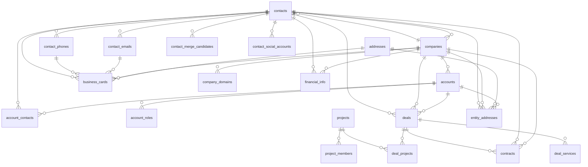
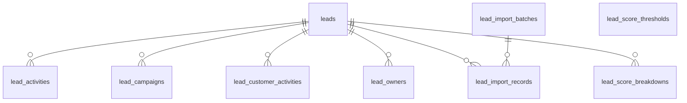
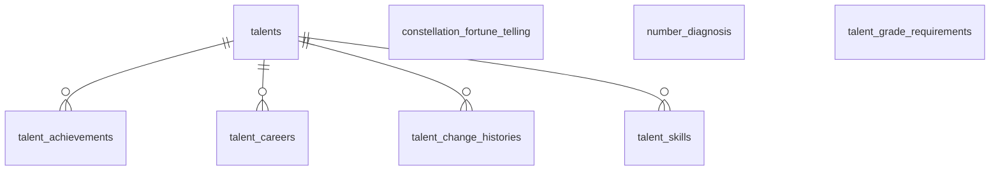
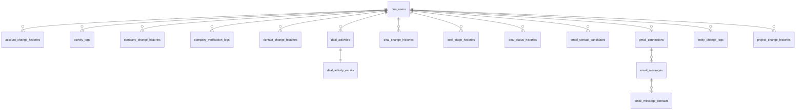

# ER 図

**このファイルは生成物。** 手で直さず `npm run db:er` で作り直す
（`scripts/generate-er-diagram.mjs`）。ローカルの DB コンテナから
テーブルと外部キーを読んで組み立てる。

テーブル 87 件・外部キー 273 本を 1 枚に描くと読めないので、
業務の領域ごとに分けた。**マスタへの参照は各図から省いている**
（どの表からもマスタへ線が伸びて図が潰れるため）。マスタは末尾に一覧で置く。

線の向き: `親 ||--o{ 子`。一意制約が付いた外部キーだけ `||--||`（1 対 1）で描く。
自己参照（連絡先の紹介者など）は線にしていない。

## 顧客と取引

名刺から事業者・連絡先が生まれ、ディールを経て契約で取引先ができる。

| テーブル | 役割 |
|---|---|
| `account_contacts` |  |
| `account_roles` | 取引先が持つ区分 |
| `accounts` |  |
| `addresses` | 住所の共通テーブル |
| `business_cards` | 名刺 |
| `companies` |  |
| `company_domains` | 法人が使うメールドメイン |
| `contact_emails` |  |
| `contact_merge_candidates` | 連絡先の統合候補 |
| `contact_phones` |  |
| `contact_social_accounts` | 連絡先の SNS・チャットの連絡口 |
| `contacts` |  |
| `contracts` | 契約 |
| `deal_projects` | ディール × プロジェクト 中間テーブル（J03） |
| `deal_services` | ディール×サービス中間テーブル |
| `deals` | ディール（取引） |
| `entity_addresses` | 住所の紐付け |
| `financial_info` | 振込先の口座 |
| `project_members` | プロジェクトメンバー（D07） |
| `projects` | 複数ディールを束ねる業務イニシアチブ（T08） |

## リードとマーケティング

取り込んだリードを育て、ディールへ昇格させるまで。

| テーブル | 役割 |
|---|---|
| `lead_activities` | リード架電記録（D08） |
| `lead_campaigns` | リード×キャンペーン 中間テーブル（J04） |
| `lead_customer_activities` | リード顧客行動ログ（D09） |
| `lead_import_batches` | リード取込の実行単位 |
| `lead_import_records` | CSV 1 行ごとの取込結果と生データ |
| `lead_owners` | リード副担当中間テーブル（T10） |
| `lead_score_breakdowns` | リードスコア算出内訳（D10） |
| `lead_score_thresholds` | スコア範囲→温度感変換マップ（旧: lead_scoring_rules） |
| `leads` | リード（見込み客）エンティティ（T09） |

## タレント

連絡先に 1 対 1 で紐づく人材の特性。

| テーブル | 役割 |
|---|---|
| `constellation_fortune_telling` |  |
| `number_diagnosis` |  |
| `talent_achievements` | タレント×実績 |
| `talent_careers` | タレント経歴 |
| `talent_change_histories` |  |
| `talent_grade_requirements` | 系統×グレード別昇格要件 |
| `talent_skills` | タレント×スキル |
| `talents` | タレント（人材特性情報） |

## やり取りと履歴

メール連携と、全エンティティ共通の変更履歴。

| テーブル | 役割 |
|---|---|
| `account_change_histories` |  |
| `activity_logs` |  |
| `company_change_histories` |  |
| `company_verification_logs` | 法人の実在確認の履歴 |
| `contact_change_histories` |  |
| `crm_users` |  |
| `deal_activities` |  |
| `deal_activity_emails` |  |
| `deal_change_histories` |  |
| `deal_stage_histories` |  |
| `deal_status_histories` |  |
| `email_contact_candidates` | 未登録アドレスの候補 |
| `email_message_contacts` | メールと連絡先の対応 |
| `email_messages` | Gmail から同期したメールのメタデータ |
| `entity_change_logs` | 全エンティティ共通の変更履歴（トリガーで自動記録・追記のみ） |
| `gmail_connections` | Gmail 連携アカウント |
| `project_change_histories` | プロジェクト変更履歴（A11） |

## マスタ

各図では線を省いた参照先。値の追加・変更は admin の「各種設定」から行う。

| テーブル | 役割 |
|---|---|
| `account_role_types` | 取引先区分マスタ |
| `account_statuses` |  |
| `account_types` |  |
| `campaigns` | キャンペーンマスタ（generation/nurturing/qualification 3種） |
| `company_statuses` |  |
| `contact_statuses` |  |
| `contract_types` |  |
| `corporate_types` |  |
| `deal_stages` | ディールステージ（phase_id カラムは 20260419000002 で廃止 |
| `deal_statuses` |  |
| `industry_classifications` |  |
| `lead_activity_types` | リードアクティビティ種別マスタ（M23） |
| `lead_call_statuses` | リード 架電ステータス（旧: inside_sales_call_statuses） |
| `lead_categories` | デマンドファネル（M22。旧称: リードカテゴリ） |
| `lead_company_sizes` | リード企業規模マスタ |
| `lead_customer_activity_types` | リード顧客行動タイプマスタ（イベント参加・資料DL等、顧客側の行動ログ種別） |
| `lead_large_segments` | リード 大セグメント（旧: inside_sales_large_segments） |
| `lead_score_rules` | リード加点ルールマスタ |
| `lead_small_segments` | リード 小セグメント（旧: inside_sales_small_segments） |
| `lead_sources` |  |
| `lead_stages` | リードステージ（7段階: リード獲得/ナーチャリング/リード選定/ディール/オポチュニティ/取引先/デッド） |
| `lead_statuses` | リードステータス（ステージに従属、UNIQUE(stage_id, code)） |
| `lead_temperatures` | リード温度感マスタ（hot/warm/cold） |
| `pipeline_types` |  |
| `project_statuses` | プロジェクトステータス マスタ（M12） |
| `services` |  |
| `skill_categories` |  |
| `skills` |  |
| `social_services` | SNS・チャットのサービス |
| `talent_achievements_master` | 実績マスタ（グレード昇格要件用） |
| `talent_grades` | グレードマスタ（A1-L4 16段階） |
| `talent_job_types` | 職種マスタ（19種） |
| `talent_system_tags` | 系統マスタ（G/SP/CO） |

## 別の見かた

| 方法 | 使いどころ |
|---|---|
| **Supabase Studio のスキーマ図** … `http://127.0.0.1:54333` → Database → Schema Visualizer | 実物を触りながら見る。カラムの型や制約もその場で確認できる |
| `docs/database-design.md` | 各テーブルの列定義・区分値・CRUD 権限。**仕様の正本はこちら** |
| `npm run db:types` で生成する `src/types/database.generated.ts` | コードから見た形。存在しない列を参照するとビルドで落ちる |
| `supabase/migrations/` | いつ何を変えたかの経緯 |
